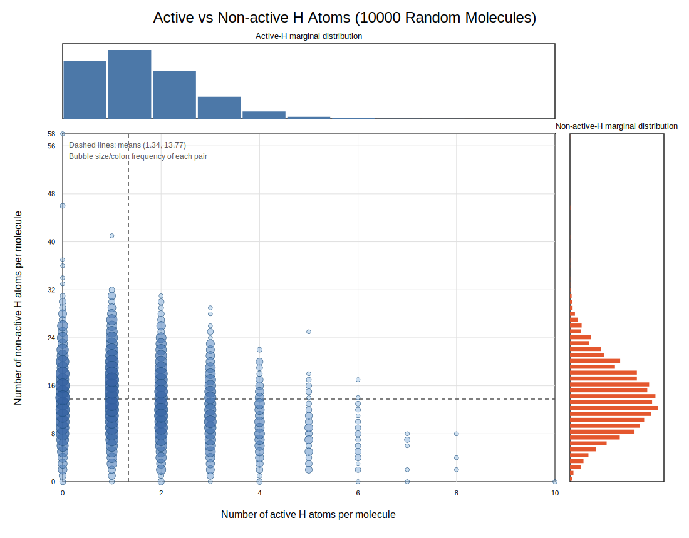
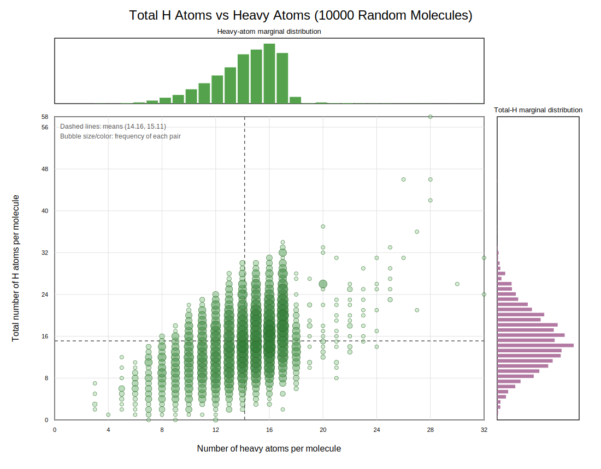

# Active Hydrogen Atoms in the Molecular Graph

SMILES strings carry no explicit hydrogen atoms. The preprocessing pipeline
calls `Chem.AddHs` to materialise all hydrogens, then decides which to keep as
real graph nodes. This document records the rule used and the reasoning behind
each choice.

---

## Definition

> A hydrogen is **active** if and only if it is bonded to exactly one heavy
> atom whose atomic number is in `{7, 8, 16}` (N, O, or S).

All other hydrogens are **non-active** and are removed from the graph. Every
active hydrogen becomes a node connected to its donor parent by a normal bond
edge; its features are computed identically to heavy-atom nodes.

```python
# src/dataset.py
_HBOND_DONOR_ATOMIC_NUMBERS = {7, 8, 16}

def _is_active_hydrogen(atom):
    if atom.GetAtomicNum() != 1:
        return False
    neighbors = atom.GetNeighbors()
    return len(neighbors) == 1 and neighbors[0].GetAtomicNum() in _HBOND_DONOR_ATOMIC_NUMBERS
```

`_active_hydrogen_mask` walks the fully-hydrogenated molecule and marks every
heavy atom and every active hydrogen `True`; `smiles2graph` keeps only those
atoms when building the node and edge arrays.

Non-active hydrogens are encoded as the scalar `possible_numH_list` feature
(index 4) on each heavy-atom node via `_non_active_hydrogen_count`, so their
count is not lost, just not a node.

---

## Design decisions

### Why not keep all hydrogens?

The median molecule in PCQM4Mv2 has ~13 non-active H atoms and only ~1 active
one (see distribution plots below). Retaining all H roughly doubles graph size
while contributing no H-bond interaction information. The extra nodes inflate
graph diameter, reduce message-passing depth per layer, and add ~15 nodes of
noise per forward pass.

### Why not drop all hydrogens?

A "heavy-atom only" graph loses the explicit donor hydrogen that participates
directly in H-bonding. For a property like the HOMO–LUMO gap — which is
sensitive to lone-pair occupation and H-bond geometry — removing the donor H
deletes a node that sits at the chemically decisive site of the molecule.

### Why N, O, S?

They are the three standard H-bond donor elements in organic chemistry: high
electronegativity, lone pairs that stabilise the polar N/O/S–H bond, and
sufficient bond polarity to make the H electrophilic. Heavier chalcogens
(Se, Te) and phosphorus compounds are vanishingly rare in PCQM4Mv2 and would
contribute statistically invisible nodes.

### Why the `len(neighbors) == 1` guard?

This is the standard terminal-atom check: a normal covalent H has exactly one
bond partner. It also rules out bridging hydrogens (three-centre two-electron
bonds), which do not appear in the organic small molecules of PCQM4Mv2.

### Why encode non-active count as a feature, not a node?

Implicit-hydrogen count on a heavy atom is a long-established proxy for
saturation and hybridisation. Keeping it as a scalar feature on the parent node
preserves that signal without adding structurally redundant nodes. The
`possible_numH_list` vocabulary (0–8) covers all per-atom non-active H
multiplicities observed in PCQM4Mv2.

---

## Effect on graph size

Measured on 10 000 random molecules sampled from PCQM4Mv2 raw SMILES:

| Statistic | Active H / mol | Non-active H / mol | Total H / mol | Heavy atoms / mol |
|---|---|---|---|---|
| Mean   | 1.34 | 13.77 | 15.11 | 14.16 |
| Median | 1    | 13    | 15    | 15    |
| Max    | 10   | 58    | 58    | 32    |

Active-H nodes add on average **1.34 nodes per molecule**. Keeping all H would
add ~15 nodes per molecule — roughly doubling graph size for no benefit to the
prediction target.

---

## Plots

Joint bubble plots from 10 000 randomly sampled molecules. Each bubble
represents one unique pair; size and colour intensity encode frequency on a
log scale. Dashed lines mark the means. Marginal distributions are shown on the
top and right axes.

**Active vs non-active H atoms**


**Total H atoms vs heavy atoms**


---

## Files

| File | Role |
|---|---|
| `src/dataset.py` | `_is_active_hydrogen`, `_active_hydrogen_mask`, `_non_active_hydrogen_count`; mask applied in `smiles2graph`. |
| `doc/act_h/plot_active_h_distribution.py` | Samples 10 000 raw-SMILES molecules, counts all four H/heavy-atom quantities, and writes both SVG plots next to this file. |
| `doc/act_h/active_non_active_h_joint_10k.svg` | Joint distribution: active H vs non-active H. |
| `doc/act_h/active_non_active_h_joint_10k_total_h_vs_heavy.svg` | Joint distribution: total H vs heavy atoms. |
