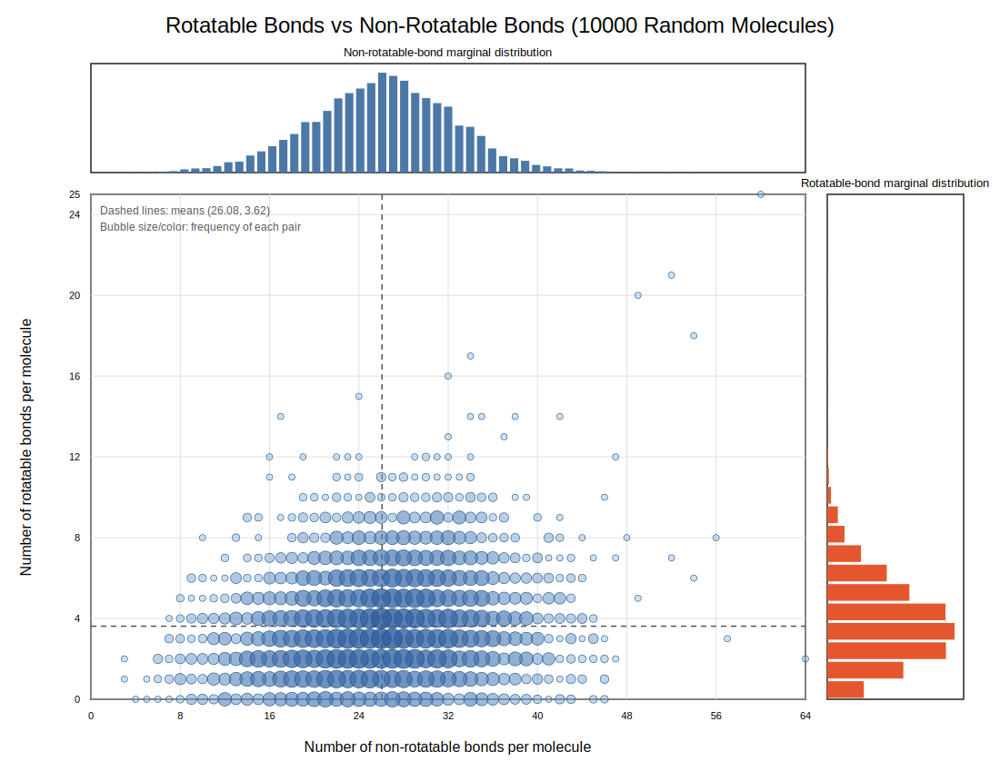

# Rotatable Bond Feature in the Molecular Graph

Each edge in the molecular graph carries four features: bond type, bond stereo,
`is_conjugated`, and `is_rotable`. This document records the definition of
`is_rotable`, the reasoning behind including it, and the SMARTS pattern used.

---

## Definition

> A bond is **rotatable** if and only if it is a non-ring single bond between
> two non-terminal, non-triple-bonded heavy atoms, excluding bonds with
> significant partial double-bond character such as amide, ester, and
> halomethyl C–X bonds.

The check is implemented in `src/dataset.py` as a SMARTS substructure match
on the fully-hydrogenated molecule (`Chem.AddHs`) so that terminal heavy atoms
and X–H bonds are correctly identified:

```python
# src/dataset.py
_ROTATABLE_BOND_SMARTS = Chem.MolFromSmarts(
    '[!$(*#*)&!D1&!$(C(F)(F)F)&!$(C(Cl)(Cl)Cl)&!$(C(Br)(Br)Br)'
    '&!$(C([CH3])([CH3])[CH3])&!$([CH3])'
    '&!$([CD3](=[N,O,S])-!@[#7,O,S!D1])&!$([#7,O,S!D1]-!@[CD3]=[N,O,S])'
    '&!$([CD3](=[N+])-!@[#7!D1])&!$([#7!D1]-!@[CD3]=[N+])]-,:;!@'
    '[!$(*#*)&!D1&!$(C(F)(F)F)&!$(C(Cl)(Cl)Cl)&!$(C(Br)(Br)Br)'
    '&!$(C([CH3])([CH3])[CH3])&!$([CH3])]'
)

def _rotatable_bond_indices(mol) -> set[int]:
    matches = mol.GetSubstructMatches(_ROTATABLE_BOND_SMARTS)
    bond_indices = set()
    for atom_idx_a, atom_idx_b in matches:
        bond = mol.GetBondBetweenAtoms(atom_idx_a, atom_idx_b)
        if bond is not None:
            bond_indices.add(int(bond.GetIdx()))
    return bond_indices
```

The SMARTS is taken verbatim from RDKit's internal `Strict` definition of
`CalcNumRotatableBonds` (see `Code/GraphMol/Descriptors/Lipinski.cpp`), so it
is consistent with the canonical RDKit rotatable-bond counting API.

`is_rotable` is stored as a binary index into `possible_is_rotable_list`
`[False, True]`, occupying the fourth position (index 3) of the edge feature
vector.

---

## Design decisions

### Why include rotatable bonds as an edge feature?

Rotatable bonds are the primary source of conformational flexibility in a
molecule. For the HOMO–LUMO gap target of PCQM4Mv2, the 3D geometry of the
molecule — and therefore the number of flexible torsional degrees of freedom —
directly affects the electronic structure through conjugation pathways,
steric interactions, and ring-strain effects. A GNN that can identify which
bonds are freely rotatable can implicitly reason about conformational
distributions without requiring an explicit 3D input.

### Why the strict RDKit definition?

The strict definition excludes bonds that look like single bonds in 2D but have
substantial rotational barriers due to partial double-bond character:

- **Amide/imide C–N bonds** (`C(=O)–N`): the nitrogen lone pair delocalises
  into the carbonyl, raising the rotational barrier to ~15–20 kcal/mol.
- **Ester/acid C–O bonds** (`C(=O)–O`): similar resonance locking.
- **Trihalomethyl and tert-butyl C–C/C–X**: excluded because the groups rotate
  symmetrically and contribute no distinct conformational states.

Counting these as rotatable would overestimate flexibility and mislabel
chemically locked bonds as freely torsional.

### Why apply `Chem.AddHs` before matching?

The SMARTS uses `!D1` (non-terminal) to exclude bonds to atoms with only one
heavy neighbour. Without explicit hydrogens, an atom bonded only to H atoms and
one heavy atom would appear as degree 1 in the implicit-H representation,
causing some bonds at the periphery of the molecule to be incorrectly included
or excluded. Adding explicit H atoms makes degree consistent with the true
molecular graph.

### Why encode as a binary feature rather than a count?

`is_rotable` is a per-bond property, not a per-molecule count. The edge
feature vector already carries bond type, stereo, and conjugation — all
binary or categorical per-bond labels. A binary flag fits naturally and keeps
the feature dimension minimal. The molecule-level rotatable bond count is an
emergent quantity the GNN can aggregate from individual edge labels.

### Why not use `CalcNumRotatableBonds` directly for edge labels?

`CalcNumRotatableBonds` returns a molecule-level integer count and provides
no API to query individual bond membership. The SMARTS match in
`_rotatable_bond_indices` is the canonical way to obtain the exact set of
rotatable bond indices, and it uses the identical underlying pattern as
`CalcNumRotatableBonds(mol, NumRotatableBondsOptions.Strict)`.

---

## Effect on bond composition

Measured on 10 000 random molecules sampled from PCQM4Mv2 raw SMILES
(after `Chem.AddHs`):

| Statistic | Rotatable bonds / mol | Non-rotatable bonds / mol |
|---|---|---|
| Mean   | 3.62 | 26.08 |
| Median | 3    | 26    |
| Max    | 25   | 64    |

Rotatable bonds account for roughly **12 %** of all bonds on average.
The majority of bonds in an organic small molecule are ring bonds, double bonds,
aromatic bonds, and X–H bonds — all non-rotatable by definition.

---

## Plots

Joint bubble plot from 10 000 randomly sampled molecules. Each bubble
represents one unique (rotatable, non-rotatable) pair; size and colour
intensity encode frequency on a log scale. Dashed lines mark the means.
Marginal distributions are shown on the top and right axes.

**Rotatable vs non-rotatable bonds**


---

## Files

| File | Role |
|---|---|
| `src/dataset.py` | `_ROTATABLE_BOND_SMARTS`, `_rotatable_bond_indices`, `bond_to_feature_vector`; rotatable flag applied per-bond in `smiles2graph`. |
| `doc/rot_bond/plot_rot_bond_distribution.py` | Samples 10 000 raw-SMILES molecules, counts rotatable and non-rotatable bonds, and writes the SVG plot next to this file. |
| `doc/rot_bond/rot_bond_joint_10k.svg` | Joint distribution: rotatable bonds vs non-rotatable bonds. |
